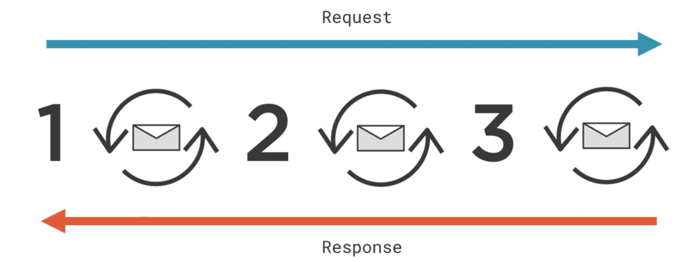

# Spring
 - Proyecto OpenSource
 - Mantenido por la compañia Pivotal

## Que es Spring
- Spring Framework
- Spring Boot
- Spring Data
- Spring Cloud
- Spring Batch
- Spring Rest
- Spring Transaction
- Spring JPA e Hibernate
- y mucho mas

Todo esto es un ecosistema.

## La familia Spring.
- Todo empieza con Spring Framework
    - Web 
    - Data
    - AOP
    - Core
- Spring projects
    - Spring LDAP
    - Spring Web Services
    - Spring Session
    - Spring Integration
    - Spring Data
    - Spring Batch
    - Spring Security
    - Spring Social
    - Spring Kafka
- Spring Boot
    - Nueva forma de crear projectos mucho mas facil de configurarlos ya que antes era mucho mas tedioso.
- Spring Cloud
    - Construido sobre Spring Boot
    - Simplifica el uso de aplicaciones distribuidas. Arquitectura en microservisios.

## Porque Spring?
- En principio o cuando empezo a destacar Spring. Era una mejor opcion que Java EE
- Actualmente Spring es mucho mas que una alternativa que Java EE.
    - Es un complemento a Java EE
    - Utiliza varias de las APIs de Java EE
- Pero la verdadera razon porque utilizar Spring es porque te ayuda y te facilita la creacion de un proyecto.
- Razones porque Spring es una buenas opcion
    - Flexible, modular y compatible hacia atras.
    - Comunidad muy grande y activa.
    - Continuamente innovando y evolucionando.
###  Ventajas de Spring
- Sólido como una roca y bien diseñado con patrones de diseño
- Resistio las pruebas del tiempo. No esta obseleto y sigue evolucionando cada año.
- Tiene una gran comunidad.
- Es un proyecdto muy popular (https://insights.stackoverflow.com/survey/2018/)
- Gran grupo de talentos
- Riqueza de conocimiento existente
- Desarrollado muy activamente
- Soporte IDE incorporado
- Escalable

### Desventajas
- Demasiada "magia"
- Curva de aprendizaje empinada
- Aumenta el tamaño de su entregable
- Difícil de depurar
- Agrega sobrecarga de memoria
- La complejidad ha crecido con el tiempo.
- Spring puede ser demasiado configurable
- Spring es "grande"
- Los proyectos comunitarios de Spring son impredecibles


## Spring boot
- Aprender una nueva tecnologia puede ser muy frustrante. Pero iniciar con Spring Boot es muy rapido y facil.
- Con Spring Boot puedo ser todo superficial y no necesitas saber que hay por detras pero poco a poco vayas aprendiendo y profundizando se adentrara en el framework.
- Spring boot se pude utilizar para:
    - Aplicaciones web
    - Aplicaciones que no sean web.
- Spring boot esta escrito sobre Spring Framework.

## Caracteristicas
- Auto-configuration.
- Independiente: Se puede ejecutar como cualquier otra aplicacion
- Obstinado: Tiene cosas por defecto

### Auto-configuration
- Spring boot auto-configura la aplicacion segun las dependencias que se hayan agregado a la aplicacion.
- Contextual e inteligente: Se configura segun el contexto(dependencias) y segun a eso lo configura automaticamente(inteligencia).

- Ejemplo de la conexion a una base de datos 

- Configuracion
```java
// Anotacion para realizar una auto-confugación
@EnabledAutoConfiguration
public class DemoApplication {

}
```
### Stadalone
- La otra caracteristica de spring boot es que puedas ejecutar como una aplicacion independiente.
- Ya no tiene que estar en un servidor web y ahorar ese proceso tedioso.

- 
```java
// Solo run
// 1. Empaquetar la aplicacion
// 2. Correr la aplicacion
java -jar my-aplication.jar
```
### Obstinado
- Spring boot es una opcion obstimada de contrucciones de aplicaciones. Es asi por la cantidad de librerias, herramientas, framework que existen esto abrumaria a cualquier desarrollador.
- Es obstinada en la configuracion y ciertas librerias para que el desarrollador empieze directamente las funcionalidades que necesita hacer.
-  Spring Initializr es un ejemplo de construccion obstinada.
    - [http://start.spring.io](http://start.spring.io)

- Creating your first Spring Boot Application
- Spring Boot Efficient Development, Configuration , and Deployment.

## Spring Framework
- Es un entorno de software universal, reutilizable que proporciona una funcionalidad particular como parte de una gran plataforma de software para facilitar el desarrollo de aplicaciones, productos y soluciones de software.

## Historia
- 2003: Rob Johnson creo Spring Framework para facilitar el desarrollo de aplicaciones ya que realmente era muy complejo y rigido empezar una aplicacion en esos años.
- Spring Framework fue creciendo y evolucionando con el tiempo.

- Spring Framework es modular

- Spring Framework se puede dividir en seis areas grandes
    - Core
    - Web
    - AOP programacion orientada a Aspectos.
    - Acceso a datos
    - Integracion 
    - Testing

### Spring Core
- Modulo Principal de Spring Framework.
- Spring Core es la mas importante y la base para crear los otros modulos.


- Spring Core proporciona un numero de diferentes funcionalidades
    - Soporte de internalizacion i18n
    - Soporte de Validacion
    - Soporte de Data Binding
    - Soporte de conversión
    - y mas...
- La principal funcinalidad es la Dependency Injection

- Hay dos opciones para cumplir con las dependencias.
    1. El objeto instancias sus propias dependencias.        
        - Parece facil
        - Objetos estrechamente entrelasados.
        - **Ejemplo** las computadoras Mac la memoria esta acoplada a al computadora y si queremos mas memoria tendriamos que comprar otra computadora.
    2. El objeto puede declarar de que depende y confiar que los objetos declarados llamen a sus dependencias.
        - Mas flexible
        - Objetos debilmente acoplados
        - **Ejemplo** Es como cuando compras una computadora y necesitas mas memoria solo compras una y la añades.
- La segunda opcione se podria llarmar Dependency Injection
    - Spring Core es un contenedor de inyeccion de dependencias.
    - Crear y administrar objectos con sus dependencias.

- Spring Core se considera como el pegamento de la aplicacion.

## Spring Web
- Es el Framework para manejar solicitudes web. 
    - Spring Web MVC
    - Spring Web Webflux

### Spring Web MVC
- Introduction to Spring MVC
- Introduction to Spring MVC 4
- Building Web App Using Spring MVC, Hibernate, Bootstrap, and REST Services
- **Servlet API**
    - Un Servlet es un objeto que recibe una solicitud y genera una respuesta en base a la esa solicitud.
    - Proporcina una API de bajo Nivel

- Estandar de solicitud usando Servlet API


- Estandar de solicitud usando Spring Web MVC


- **Ventajas de usar Spring MVC**
    - Proporciona una API de mayor nivel
        - Uso mas facil
        - Una mayor productividad

## Spring WebFlux
- Spring WebFlux: Getting Started
- Spring WebFlux es otra forma de manejar solicitudes
- **Programación Reactiva**
    - Un paradigma de programación declarativa relacionado con los flujos de datos y la propagación del cambio.
- Una forma diferente de manejar las solicitudes web.
    - Ejecucion Asincrona
    - No bloqueante(wait)
        - Mejor utilizacion de recursos.
- Flujo tradicional


- Flujo reactivo


## Spring AOP(Aspect-oriented Programming)
- Aspect Oriented Programming (AOP) using Spring AOP and AspectJ
- **Programación Orientada a Aspectos**
    - Un paradigma de programación que apunta a aumentar la modularidad al permitir la separación de preocupaciones transversales.        
        - Una forma de programar
        - Aumenta la organización del código para
        - Preocupaciones que abarcan múltiples niveles o capas de una aplicación.
- Spring AOP tienes dos caracteristicas principales
    - Se usa para implementar características en Spring.
    - Una herramienta valiosa para que los desarrolladores manejen preocupaciones transversales.
- Spring Security implementa Spring AOP
- **Ejemplo** Sin Spring AOP
```java
// Application Security
public void sensitiveOperation(){
    // Primero revisa si el usuario tiene el Role correcto
    if() {
        // Operacion si el usuario esta autorizado
    } else {
        // Error si el usuario no esta autorizado
        // redireccionar a la pagina principal o mensaje que no puede acceder a esta seccion
    }
}
```

- **Ejemplo** Con Spring AOP
```java
// Application Security with Spring AOP
@PreAuhorize(hasRole('admin'))
public void sensitiveOperation(){
    
}
```

## Spring Data Access
- **El módulo Spring Framework Data Access facilita el desarrollo de aplicaciones que interactúan con los datos.**
- Sin Spring Data Access
```java
try {
    Statement stmnt = conn.createStatement();
    try {
        ResultSet rs = stmnt.executeQuery("SELECT COUNT(*) FROM foo");
        try {
            rs.next();
            int cnt = rs.getInt(1);
        } finally {
            rs.close();
        }
    } finally {
        stmnt.close();
    }
} catch (SQLException e) {
    // handle error
} finally {
    try {
        conn.close();
    } catch (SQLException e) {
        // handle error
    }
}
```
- Con Spring Data Access
```java
int cnt = new JdbcTemplate(ds).queryForInt("SELECT COUNT(*) FROM foo");
```

- Transacciones de bases de datos con Spring con el módulo de acceso a datos de Framework es realmente fácil.
- Que es una transaccion: Una transacción es unidad de trabajo que debe pasar todo o nada en absoluto.
- Que es una transaccion de base de datos: Una transacción de base de datos es una serie de operaciones de base de datos que deben pasar juntos o nada en absoluto.


- Sin Spring Data Access
```java
public void operation() {
    try {
            connection.setAutoCommit(false);
            // 1 or more queries or updates
            connection.commit();
        } catch (Exception e) {
            connection.rollback();
        } finally {
            connection.close();
        }
}
```
- Con Spring Data Access
```java
@Transactional
public void operation(){
    // code
}
```
- El modulo Data Access de Spring Framework también proporciona traducción de excepciones.
    - Si se produce un error al realizar operaciones en una base de datos Mysql, Oracle, PostgreSQL si utilizamos Spring Data Access nos los traducira a una Excepcion.
- Spring Data Access no data la opciones de tener Testing con las operaciones que realizamos.

## Spring Integration
- Su utilidad es para poder hacer mas facil la integracion.
- Hay diferentes formas de integracion.
    - RMI
    - Messaging Systems
    - Web Services
- Crear o exponer un Web Services con Spring
```java
@RestController
public class AccountController {
    @GetMapping("/account/{id}")
    public Account find(@PathVariable int id) {
        // look up account by id
    }

}
```

- Consumir un servicio con Spring se utiliza RestTemplate
    - Abstrae los tediosos detalles
    - Maneja
        - Connectividad del web service.
        - Envia el comando
        - Maneja las respuestas
```java
restTemplate.getForObject("http://foo.com/account/123", Account.class);
```

## Spring Testing
- Spring maneja dos forma de test
    - Unit testing: Es un proceso de desarrollo de software de las partes comprobables más pequeñas de una aplicación, llamadas unidades, son examinado individual e independientemente para determinar si operación esta correcta o no tiene ningun error.
    - Integration testing: Son las pruebas de software en la los módulos de software individuales se combinan y se prueban como un grupo. Esto se produce después de las pruebas unitarias.
    
### Spŕing Integration testing
- Spring testing proporcina soporte para probar ecenarios comunes.
    - Testing con datos
    - Testing en una aplicacion web.
- Limpiar los test despues de ejecutarlos

## Spring Data
- Getting Started with Spring Data JPA
- Getting Started with Spring Data Rest
- [https://spring.io/projects/spring-data](https://spring.io/projects/spring-data)
- La misión de Spring Data es proporcionar un modelo de programación familiar y consistente basado en Spring para el acceso a los datos, al tiempo que conserva los rasgos especiales del almacén de datos subyacente.
- La diferencia con Spring Data Access que es este esta pensado para Base de datos Relacionales mientras que Spring Data esta pensado para base de datos realaciones y no relacionales.
- Srping Data es un subprojecto, por simismo no puede hacer nada es mas como un complemento a los anteriores.

## Spring Cloud
- Spring Cloud Fundaments
- [https://spring.io/projects/spring-cloud](https://spring.io/projects/spring-cloud)
- Spring Cloud esta basado en Spring Boot y esta pensado para sistemas distribuidos.
- Esta pensado para una arquitectura en microservicios.

## Spring Security
- Spring Security Fundamentals
- [https://spring.io/projects/spring-security](https://spring.io/projects/spring-security)
- Esta pensado para autenticacion y autorizacion basado en estandares.
- Spring Security ayuda a proteger sobre ataques comunes, scripts, 