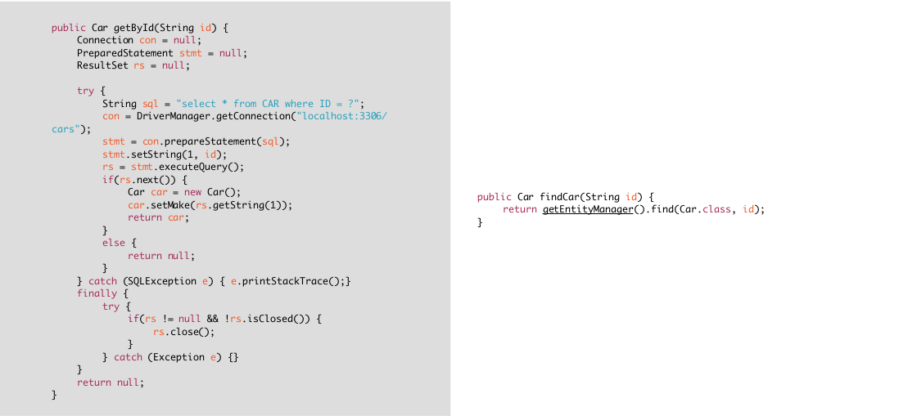

# Spring 
## Que es Spring
- Es una inversion de contenedor de control esta tecnica que es conocida como Inyeccion por dependencia.
- Fue creado para reemplazar los EJB(Enterprise JavaBeans) configuraciones muy complejas
- Para simplificar las configuraciones complejas que se realizan en JEE.
- Basado en POJO con esto spring hace que todo sea simple
- Discreto que te debe hacer más fácil todo y no complicarte la vida si te esta complicando es que lo estas utilizando mal.
- AOP/Proxies con esto te facilita el utilizar transacciones con todo esto el codigo es mas simple.
- Mejores practicas y sin darnos cuenta implementamos varios patrones de diseño
    - Singleton
    - Factory
    - Abstract Factory
    - Template method

## Lo que se busca en un Framework
- Testeabilidad
- Mantenibilidad
- Escalabilidad
- Complejidad
- Enfoque comercial

## Lo que ofrece Spring
- **Configuracion** mas simple
- Al desarrollador solo le interesara la **logica de negocios**
- **Testing** centrarse en las pruebas
- Anotaciones o xml para facilitar las configuraciones
- Spring impulsa el desarrolo en **basado en interfaces**.

## Ejemplo

## Porque Spring
- Patrones de diseño implementados de JEE
- WORA(Write Once, Run Anywhere)
- Porque se escribira mucho menos codigo

## Empezar con Spring
- No se puede descargar directamente
- Solo se puede utilizar Maven o Gradle
- Se obtiene Source, JavaDocs, Binaries
- Se utiliza maven o gradle por las Dependencias Transitivas.
- Spring Boot una caja negra se puede desarrollar rapidamente.

## Projecto sin Spring
[ejemplo1](../projects/ejemplo1)

## Spring Configuration usando Java
- No hay archivo xml para el contexto de la aplicacion.
- En las primeras versiones de Spring todas las configuraciones se realizaba con XML.
    - Los desarrolladores bromeaban diciendo que se tiene que se Desarrollador XML en lugar de ser un desarrollador Java.
- Versiones superiores se añadio los namespace que ayudo algo y aun asi se requeria que sea mas simple el desarrollo
- Por este motivo ahora se añadio la configuracion solo con puro java.
[ejemplo2](../projects/ejemplo2)
