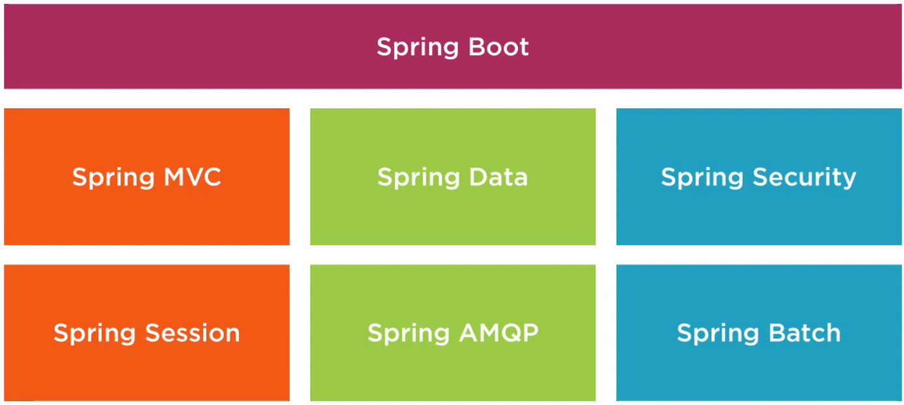
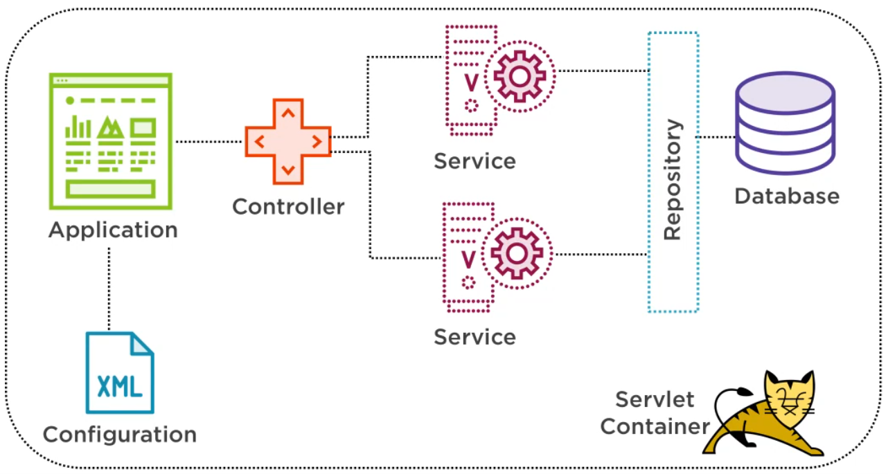
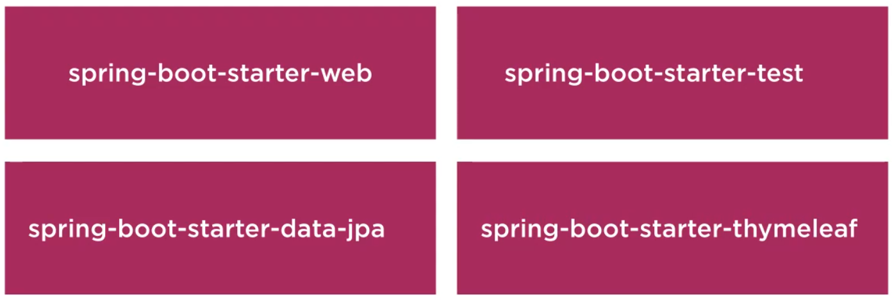

# Spring boot

## Que es Spring Boot

- Un proyecto basado en Spring
  
- Se puede desarrollar rapidamente.
- Configuraciones minimas a nivel de properties
- No se necesita un servidor de aplicaciones para ejecutarlo(No es necesario Tomcat) se puede ejecutar con un comando.
- Estructura
  

## Caracteristicas

- Independiente porque no tiene una realacion directa con el proyecto Spring
- Servidores embebidos
    - Tomcat
    - Jetty
    - Undertow
- Sin generacion de archivos xml.
- Metricas de salud de la aplicación
    - Validar estado de los servicios que se ejecutaron
    - Validar las dependencias e inyeccion de dependencias para los servicios
    - Verificar el estado de la memoria
- Automatización automatica
- Dependencias de inicio
- Spring boot CLI
- Actuator

## Autoconfiguration y runtine

- Configura automáticamente tus aplicaciones de las dependencias que se añadieron mediente maven o gradle.
- Siempre podemos personalizar la configuración
- Ejemplo
    - **Database H2:** Autoconfigura spring boot la base de datos pero podemos añadir nuestra propia
      configuracion de conexion.

## Dependencias de inicio

- Las dependencias de inicio se incluyen en el archivo POM o Gradle y actuan como un paquete de inicio que incluye todas
  las bibliotecas que necesita.
  
- Configuracion minima para para hacer una aplicacion web con Spring

```xml
<dependencies>
    <dependency>
        <groupId>org.springframework</groupId>
        <artifactId>spring-web</artifactId>
        <version>5.1.8.RELEASE</version>
    </dependency>

    <dependency>
        <groupId>org.springframework</groupId>
        <artifactId>spring-webmvc</artifactId>
        <version>5.1.8.RELEASE</version>
    </dependency>
</dependencies>
```

- Configuracion minima para para hacer una aplicacion web con Spring Boot

```xml
<dependencies>
  <dependency>
    <groupId>org.springframework.boot</groupId>
    <artifactId>spring-boot-starter-web</artifactId>
  </dependency>
</dependencies>
```
- Otros ejemplos
  - spring-boot-starter-test: 
    - Incluye librerias de testing
    - JUnit
    - Mockito
    - Hamcrest
    - Spring core
    - Spring test
  - spring-boot-starter-data-jpa
    - Spring Data JPA con Hibernate
    - JDBC
    - Entity Manager
    - Transaction API
    - Spring Data JPA
    - Aspects
  - spring-boot-starter-web
    - Desarrollo de aplicaciones web
    - Spring MVC
    - Rest
    - Tomcat
    - Jackson

## Spring Boot CLI
- Interfaz de linea de comandos
- Escribir una aplicacion usando Groovy Scripts
- Contruir prototipos rapidos

## Actuator
- Monitor running application: Se puede obtener un vistazo a la informacion operativa interna del tiempo de ejecucion  sobre la aplicacion.
- Administrar via HTTP endpoints o JMX
- Se podra ver cosas como:
  - Health status: Estado de salud de su aplicacion
  - Metrics: Varias metricas sobre la aplicacion
  - Loggers: Configuracion de los loggers
  - Audit events: Eventos de auditoria
  - HTTP Trace: Informacion de seguimiento HTTP
## Anotaciones

- Una anotacion es una forma de añadir metadatos al codigo fuente de java que estan disponibles
  para la aplicacion en tiempo de ejecucion y compilacion.
- Una alternativa al uso de XML.
- Tipo de anotaciones
    - @Controller: Una clase con esta anotacion gestionar las peticiones HTTP get,post, put, delete, etc.
    - @Repository: Una clase o interfaz con esta anotacion sera utilizada para el acceso a la base de datos.
    - @Service Una clase o interfaz con esta anotacion se encargara a la llamada de APIs externas, calculos, logica de
      negocios.
    - @Component Se utiliza cuando en las clase de utilidad se podria decir en clase mas genericas

```java

@Service
public class CourseServiceImpl implements CourseService {

    @Autowired
    private TeacherService teacherService;

    @Autowired
    private StudentService studentService;
} 
```

## Dependencia

- Son objetos definidos que tiene una funcionalidad
- Sin esta funcionalidad los otros objetos no podran trabajar porque dependen de ellas.
- Las dependencias se utilizan para que nos ayuden a cumplir un objetivo

## Create project

- Spring Initializr.
- IDE
- Spring Boot CLI

### Spring Initializr

- [http://start.spring.io](http://start.spring.io)

### IDE

- IntelliJ IDEA Ultime PRO tiene incluido el Spring Initializr para poder crear projectos

### Spring Boot CLI

- https://docs.spring.io/spring-boot/docs/current/reference/html/getting-started.html#getting-started.installing.cli
- Manual de Spring CLI - https://docs.spring.io/spring-boot/docs/current/reference/html/cli.html
- Instalar SDKMan
-

```
sdk ls springboot
sdk install springboot
```
